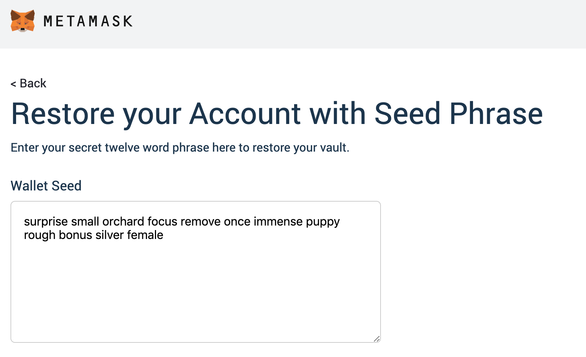
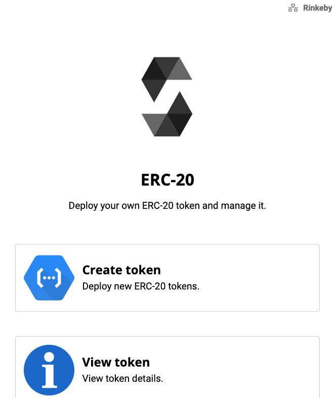

## Installation

We recommend the following versions of [Node](https://nodejs.org/) and [NPM](https://www.npmjs.com/):

* Node.js 12.13.0 or above
* NPM 6.12.0 or above

To start using solUI first install the command-line interface, which is a
[Node.js package](https://www.npmjs.com/package/@solui/cli). We recommend that you install it globally:

```shell
npm install -g @solui/cli
```

## Setup local network

You can use solUI on the Ethereum mainnet or any of the test networks, but for
now we'll use a local test net for development purposes. We recommend
using [ganache](https://www.trufflesuite.com/ganache) for this. Run:

```shell
npx ganache-cli
```

This will output some intialization information followed by a randomly generated
mnemonic, e.g:


Note down the mnemonic pass phrase. You will need to enter this into Metamask (see below).

## Setup your Dapp browser

Ensure you have [Metamask](https://metamask.io/) installed for your browser. Login
to it using the mnemonic pass phrase you wrote down earlier:



You should now see your default account with 100ETH showing in it.


## Run the demo

Clone the demo repository and set it up:

```shell
git clone https://github.com/solui/demo.git
cd demo
npm install
```

Compile and deploy the demo contracts to build the contract JSON artifacts:

```shell
npm run compile
npm run migrate
```

Now view the ERC-20 Dapp:

```
solui view --spec contracts/erc20/ui.json --artifacts build/contracts
```

Open up the browser to http://localhost:3001 and you will now be able to view
and use the ERC20 token Dapp:



## Make some changes

Whenever you change the Dapp spec _or_ rebuild the contract artifacts, solUI will
[auto-reload](https://webpack.js.org/concepts/hot-module-replacement/) the Dapp in your browser.

Try this out by editing `contracts/erc20/ui.json`. Edit the root `title`
property:

```js
{
  ...
  "title": "This title has been updated!",
  ...
}
```

Switch to the browser window and notice that the Dapp title has automatically been updated without a
page reload! Changes to the contract build artifacts also get picked up automatically, so you can
compile new versions of your contracts and the Dapp will auto-reload them in.

If you any mistakes in your spec then solUI will display a friendly error
pointing out the specific issue.

Check out the [full specification documentation](../Specification) to learn about
what else you can diisplay in your new Dapp.


## Publish

Once your Dapp is ready you can publish it to the solUI cloud so that everyone can
use it!

First, login:

```shell
solui login
```

One logged in, do:

```shell
solui publish --spec contracts/erc20/ui.json --artifacts build/contracts
```

The console should output a URL where you can view your IPFS-hosted Dapp. Read the
[publishing docs](../../Publishing/Overview) for more information.